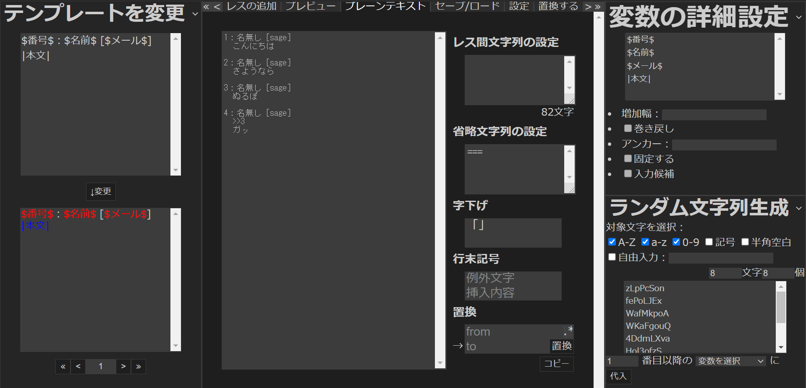

# 1. 作業の流れ
Anygetにおける作業は、基本的に以下の流れに沿って行われます。

1. [サイト](https://qwegat.github.io/Anyget/)にアクセスする
2. **初期設定**を済ませる
3. 執筆する
4. 作品を**出力**する
5. セーブする

## 1.1 サイトにアクセスする

[https://qwegat.github.io/Anyget/](https://qwegat.github.io/Anyget/)を開きます。

初期状態では、アクセス時の画面には**スタートメニュー**が表示されています。

スタートメニューは、後述のプリテンプレートを使用する場合などに便利です。

## 1.2 初期設定を済ませる

「テンプレートを変更」「変数の詳細設定」「ラベルの詳細設定」などのパネルやメインパネルの「設定」モードなどで初期設定を行います。

これらの機能については後の章で詳しく解説します。今回は、スタートメニューのアイコンから「掲示板」の**プリテンプレート**を使用しましょう。

## 1.3 執筆する

執筆は、メインパネルの「レスの追加」モードで行います。

テンプレートに基づいてテキストボックスが生成されているので、ここに文字列を打ち込んで「投稿を追加」をクリックしましょう。

## 1.4 作品を出力する

完成した作品を、目的に応じた形式で**出力**します。

今回は普通の小説として出力するので、「プレーンテキスト」モードを開き、テキストボックスの中身をコピーしましょう。

  

## 1.5 セーブする

作品のデータが失われてしまうと、手直しをしたくなった時に困ります。そこで、作品のセーブデータをダウンロードしておきましょう。

メインパネルの「セーブ/ロード」モードを開き、ファイル名を入力して「セーブ」することで、`.json`形式でファイルをセーブできます。

タブを閉じる際、ブラウザのlocalStorageに5件までのセーブデータを保存する機能もあります。

このlocalStorageのデータは、スタートメニューなどからロードすることが可能です。

