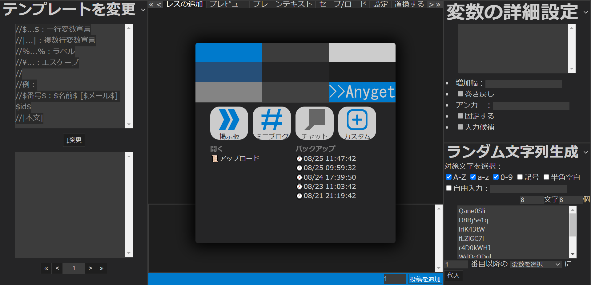

# &gt;&gt;Anygetの基本
## 流れ
Anygetにおける執筆は、基本的に以下の流れに沿って行われます。

1. [サイト](https://qwegat.github.io/Anyget/)にアクセスする
2. **初期設定**を済ませる
3. 執筆する
4. 作品を**出力**する

### 1. サイトにアクセスする

[https://qwegat.github.io/Anyget/](https://qwegat.github.io/Anyget/)を開きます。

初期状態では、アクセス時の画面には**スタートメニュー**が表示されています。

スタートメニューは、後述のプリテンプレートを使用する場合などに便利です。

### 2. 初期設定を済ませる

「テンプレートを変更」「変数の詳細設定」「ラベルの詳細設定」などのパネルやメインパネルの「設定」モードなどで初期設定を行います。

スタートメニューに表示されているボタンから、プリセットで用意されているテンプレートを開くことができます。

### 3. 執筆する

執筆は、メインパネルの「レスの追加」モードで行います。

設定したテンプレートを参照してパネル下部の**投稿フォーム**にテキストボックスが追加されるので、ここに投稿内容を入力していき、一つの投稿が完成したら**「レスの追加」ボタン**を押して一覧に投稿を追加します。

### 4. 作品を出力する

完成した作品を、目的に応じた形式で**出力**します。

例えば小説投稿サイトに投稿する場合、メインパネルの「プレーンテキスト」モードを選択します。

