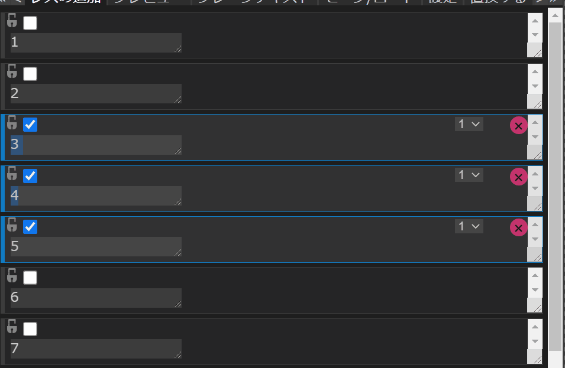

# 2. 投稿を操作する

メインパネルの「レスの追加」モードでは、投稿を追加するだけでなく、追加した投稿に対して様々な操作を加えることが可能です。

この章では、基本的な投稿の操作について記します。

## 2.1 選択する

[投稿を選択する](../Reference/MainPanel/01_add/select.md)ことで、投稿を**まとめて操作**することが可能です。

## 2.2 削除する

投稿の右上に存在する「×」ボタンをクリックすることで、対象の投稿を削除することができます。

動画のように、削除による**番号のズレ**が発生することを防ぎたい場合は、後の章に登場する「変数の詳細設定」パネルの「固定する」機能を利用してください。

## 2.3 使用するテンプレートを変更する

右上のプルダウンメニューから、投稿レベルで使用するテンプレートを変更できます。

プルダウンメニューの選択肢は**テンプレートの番号**であり、「テンプレートの変更」パネルで編集したテンプレートの数だけ表示されます。

## 2.4 固定する

南京錠マークのチェックボックスをクリックすることで、投稿を**固定する**事が可能です。

固定された投稿は削除や並び替えの影響を受けません。

## 2.5 並び替える

選択状態の投稿をドラッグ&amp;ドロップすると、**並び替え**を行えます。

並び替えは投稿における使用テンプレート、テキストボックスへの入力内容、リサイズ状態などの情報を移動させます。

並び替えは単純に**選択状態の投稿**すべてに行われるため、例え選択状態の投稿の間に未選択状態の投稿が挟まっていても、並び替えの対象にはなりません。

## 2.6 検索/置換

「レスの追加」モードで`Ctrl`+`F`キーを押すことで、メインパネルの右上に**検索ボックス**が表示されます。

