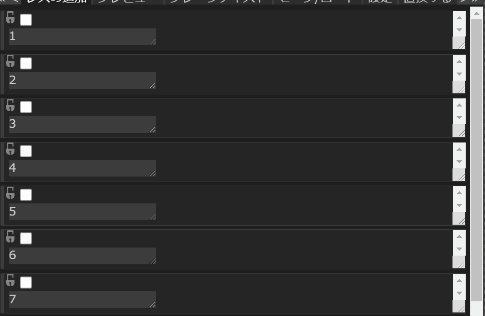

# 2. 投稿を操作しよう

Anygetの「レスの追加」欄では、投稿を追加するだけでなく、追加した投稿に対して様々な操作を加えることが可能です。

この章では、基本的な投稿の操作について記します。

## 2.1 選択する

追加された投稿をクリックしたり、投稿左上のチェックボックスを操作することで、投稿の**選択**が可能です。

選択済みの投稿に対し操作を行うと、選択済みの投稿**すべて**に同じ操作が行われます。

`Shift`キーや`Ctrl`キーなどを押しながら行うことで、多様な方式で選択を行えます。

### 左クリック

- 他に選択状態の投稿がある場合：
  - 他の投稿の選択を解除し、自分を選択する。
- そうでなければ：
  - 自分の選択状態を反転する。

### `Ctrl`+左クリック

- 自分の選択状態を反転する。

### `Shift`+左クリック

- 自分が未選択の場合：
  - 自分より上に選択状態の投稿がある場合：
    - 自分より上にある選択状態の投稿のうち、最も自分と近い物から、自分までの投稿を、すべて選択状態にする。
  - また、自分より下に選択状態の投稿がある場合：
    - 自分から、自分より下にある選択状態の投稿のうち、最も自分と近い物までの投稿を、すべて選択状態にする。

 

### `Ctrl`+`Shift`+左クリック

- 自分を選択する。

## 2.2 削除する

投稿の右上に存在する「×」ボタンをクリックすることで、対象の投稿を削除することができます。

動画のように、削除による**番号のズレ**が発生することを防ぎたい場合は、後の章に登場する「変数の詳細設定」パネルの「固定する」機能を利用してください。

## 2.3 使用するテンプレートを変更する

右上のプルダウンメニューから、投稿レベルで使用するテンプレートを変更できます。

プルダウンメニューの選択肢は**テンプレートの番号**であり、「テンプレートの変更」パネルで編集したテンプレートの数だけ表示されます。

## 2.4 固定する

南京錠マークのチェックボックスをクリックすることで、投稿を**固定する**事が可能です。

固定された投稿は削除や並び替えの影響を受けません。

## 2.5 並び替える

選択状態の投稿をドラッグ&amp;ドロップすると、**並び替え**を行えます。

並び替えは投稿における使用テンプレート、テキストボックスへの入力内容、リサイズ状態などの情報を移動させます。

並び替えは単純に**選択状態の投稿**すべてに行われるため、例え選択状態の投稿の間に未選択状態の投稿が挟まっていても、並び替えの対象にはなりません。

