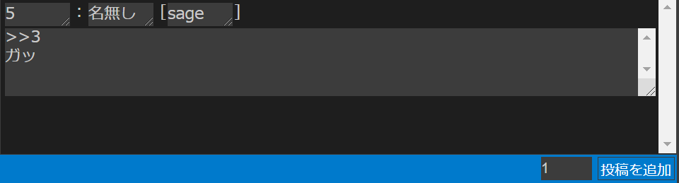

# 3. テンプレートについて

テンプレートは、Anygetでの作業において使用される**投稿の雛型**です。

[作業の流れ](01_Basic.md)のページではあらかじめ用意されたプリテンプレートを使用しましたが、この章ではより詳細な解説を行います。

## 3.1 テンプレートとは？
掲示板小説は、基本的に**特定の雛型の連続**という事ができます。
例えば、このような小説を考えます。

```
1：名無し [sage]
　こんにちは

2：とおりすがり [sage]
　さようなら

3：名無し []
　ぬるぽ

4：名無し [sage]
　>>3
　ガッ
```

まず、この小説を**分割**してみましょう。

```
1：名無し [sage]
　こんにちは
```

```
2：とおりすがり [sage]
　さようなら
```

```
3：名無し []
　ぬるぽ
```

```
4：名無し [sage]
　>>3
　ガッ
```

すると、このように分けることが可能です。

こうして分かれた投稿を見てみれば、どれもある種の**規則性**に沿っている事が分かります。つまり、

- 下に行くにつれ増えていき、`>>`でアンカーを付けられている「**番号**」
- 人によって違う場合もある「**名前**」
- 空欄だったり`sage`だったりする**メール欄**
- 行頭が字下げされている「**本文**」

……といった「変化しうる」存在と、

- `：`
- `[`
- `]`

……のような**変化しない**存在が組み合わさって、一つの投稿を作り出しているのです。

Anygetでは、前者を**変数**、後者を**字の文**と呼びます。

## 3.2 テンプレートを設定する
Anygetでは、「テンプレートを設定」パネル上部のテキストボックスに**テンプレート記法**でテンプレートを入力して「変更」ボタンをクリックすることでテンプレートを設定可能です。

テンプレートを設定すると、メインパネル「レスの追加」モードの入力フォームが変化し、テンプレートの内容に応じて**テキストボックス**が配置されます。

テンプレートは複数個設定でき、投稿単位で使い分けることもできます。

### テンプレート記法

この部はチュートリアルなので、最低限のテンプレート記法について記します。より詳細な記述については、[テンプレートリファレンス](../docs/Reference/Template.md)を参照してください。

前述の通り、テンプレートには**変数**と**字の文**がありますが、変数はさらに細分化することが可能です。この場合、**一行変数**と**複数行変数**です。一行変数は文字通り改行不能な変数で、複数行変数は改行可能な変数です。例えば複数行変数は「変数特定値メモ」パネルで利用できないとか、あるいは一行変数は**字下げ**出力設定が使えないとか言った風に、これらの間にはさまざまな違いがあります。

テンプレートの表記は、基本となる字の文の中で、宣言したい変数の名前を特定の記号で**囲む**形で行われます。一行変数の記号は`$`、複数行変数の記号は`|`です。つまり、例えば前述の小説のテンプレートは、

```
$番号$：$名前$ [$メール$]
|本文|
```

という内容になっています。

また、そのテンプレートを設定したことによって、「レスの追加」モードの入力フォームは、

  

……というような配置に編集されています。

### ラベル

チュートリアルでは省略しますが、変数と字の文の他に**ラベル**という概念も存在します。

詳しくは、[テンプレートリファレンス](../Reference/Template.md)を参照してください。

## 3.3 変数の詳細設定を行う

変数は、ある程度のカスタマイズを必要とする場合があります。

例えば先ほどの例で言うなら`$番号$`変数について考えてみましょう。まず**並び替えの影響を受けない**必要があります、つまり、「変数の詳細設定」パネルから「固定する」をオンにしなければいけません。それによって、他の変数は並び替えられても、番号は一貫して固定されたままの状態が作れます。


また、投稿を追加するたびに**1ずつ増加**すると便利です。掲示板における投稿番号というのは大体の場合連番なので、自動増加は手間を省いてくれるはずです。これを実現するためには「増加幅」に`1`を設定します。


このように、変数1つ1つに別々の設定を行いたい場合は、変数の詳細設定を行うことで実現できます。